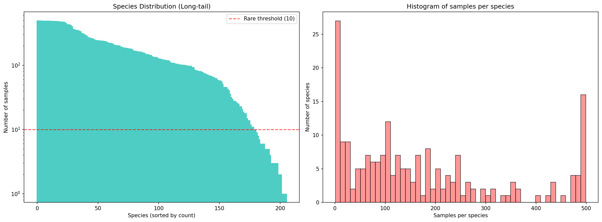
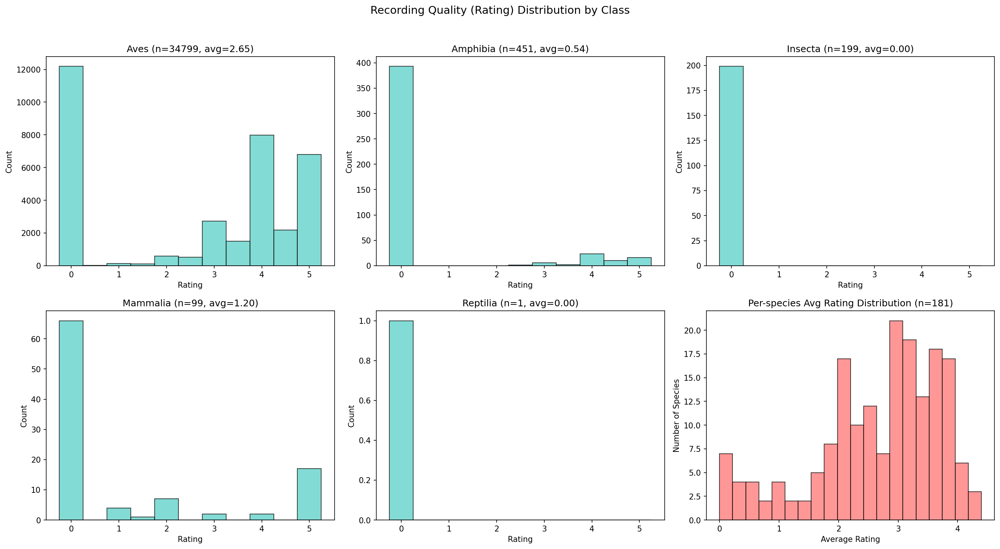
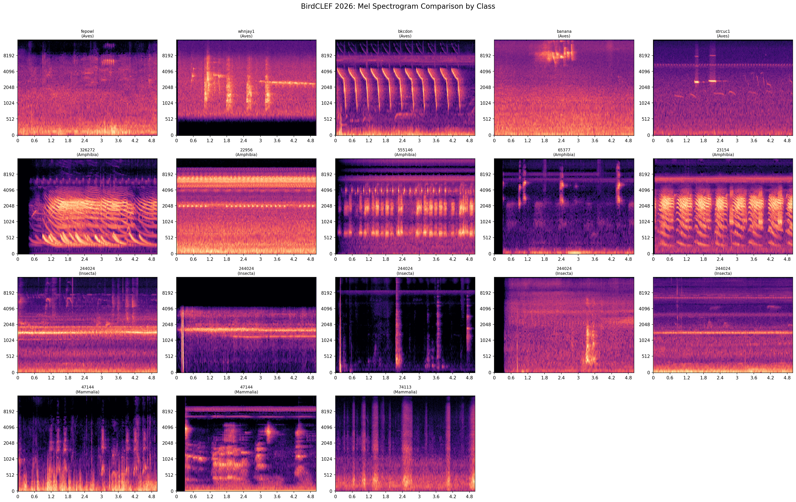
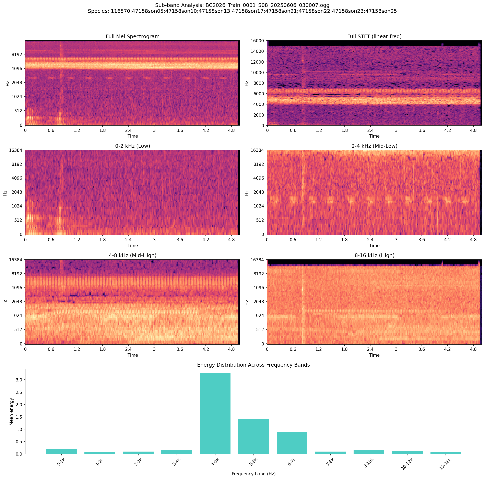
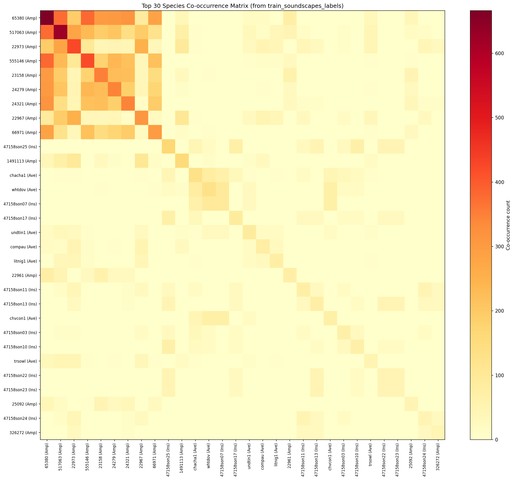
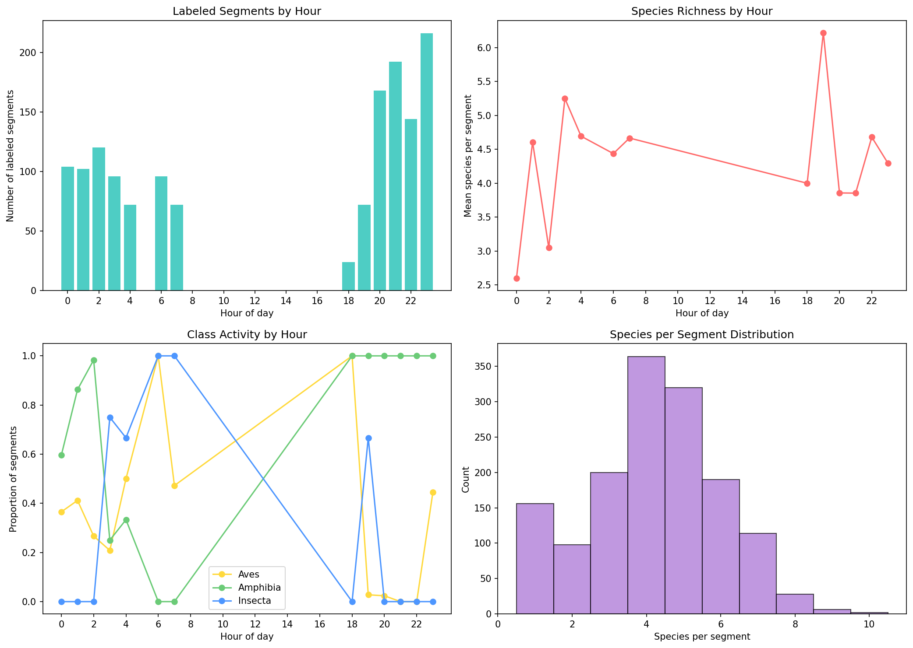
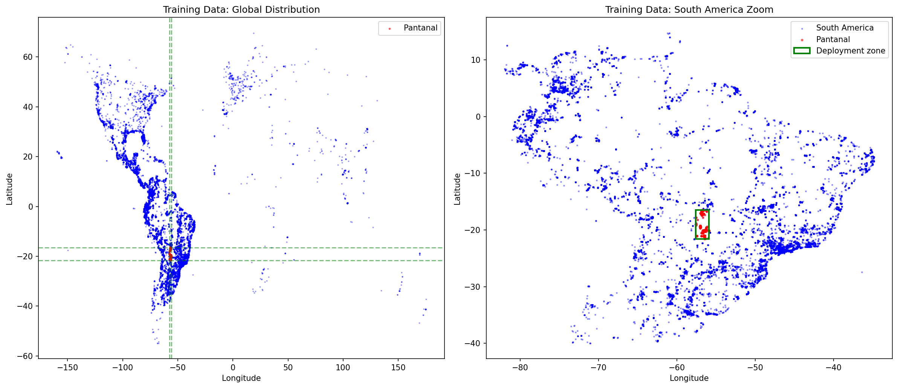
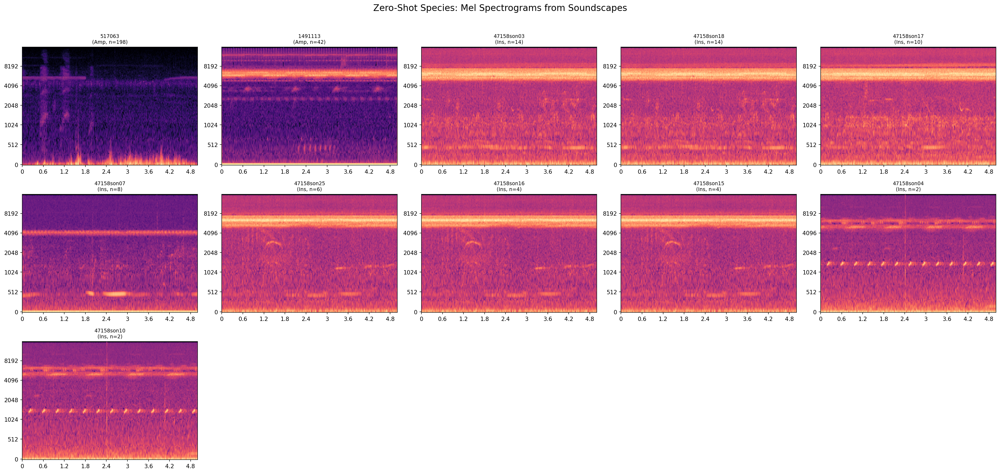
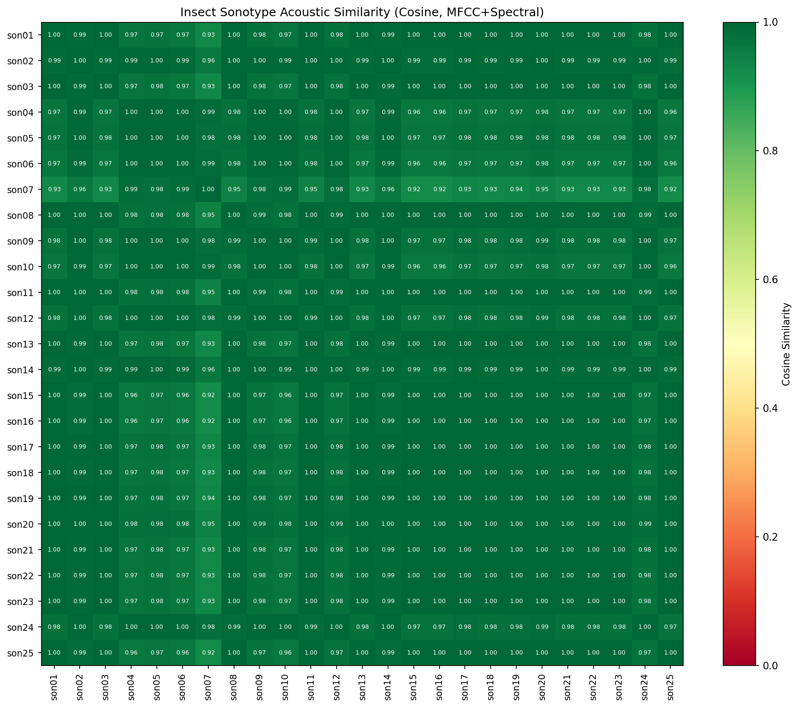

<!--
  📋 状态卡片
  id: ANAL-002
  title: BirdCLEF+ 2026 数据 EDA 分析
  type: analyze
  status: active
  created: 2026-03-25
  updated: 2026-03-25
  author: fangyj0708
  tags: [BirdCLEF, 数据分析, EDA, 音频, 长尾分布]
  depends_on: [ANAL-001]
-->

# ANAL-002: BirdCLEF+ 2026 数据 EDA 分析

> **日期**: 2026-03-25
> **数据来源**: Kaggle `birdclef-2026` 竞赛数据集（27GB 原始，15GB 音频）

## 摘要

234 个物种（不仅是鸟），35,549 条训练录音 + 10,658 条无标注声景 + 1,478 条已标注声景片段——长尾分布严重，但组委会提供了珍贵的声景标注数据来缓解域偏移。本文档不仅分析数据特征，还在每个章节末尾给出**从数据到代码的策略指导**（标记为 `→ 策略指导`），第七节汇总为完整建模流程。

**与 ANAL-001 预期的关键差异**:

| ANAL-001 假设 | 实际情况 | 影响 |
|--------------|---------|------|
| 650+ 鸟类物种 | **234 种**（162 鸟 + 35 两栖 + 28 昆虫 + 8 哺乳 + 1 爬行） | 模型复杂度降低，但需处理跨纲分类 |
| 仅限鸟类 | 5 纲动物 | 频谱特征差异大（鸟 vs 蛙 vs 昆虫） |
| 所有物种有训练音频 | **28 种零样本**（25 昆虫 sonotype + 3 其他） | 必须从声景标注中学习 |
| 无标注声景 | 存在 **1,478 条标注声景** | 域适应有直接监督信号 |

---

## 一、数据集全景

### 1.1 文件结构

```
data/raw/ (27GB)
├── train.csv                6.5 MB   训练元数据 (35,549 条)
├── taxonomy.csv             ~5 KB    物种分类表 (234 种)
├── train_audio/             35,549 .ogg   干净单物种录音 (按物种分目录)
├── train_soundscapes/       10,658 .ogg   无标注野外连续声景
├── train_soundscapes_labels.csv  ~100 KB  声景标注 (1,478 个 5s 片段, 66 文件)
├── sample_submission.csv    提交格式: row_id → 234 列概率值 (5s 粒度)
├── recording_location.txt   Pantanal, -16.5~-21.6°, -55.9~-57.6°
└── test_soundscapes/        空 (Code Competition 不可见)
```

### 1.2 数据规模

| 数据类型 | 文件数 | 大小 | 格式 |
|---------|--------|------|------|
| 训练音频 | 35,549 | ~11 GB | .ogg, 32kHz, 单声道 |
| 无标注声景 | 10,658 | ~4 GB | .ogg, 32kHz, 单声道 |
| 标注声景 | 1,478 片段 / 66 文件 | - | 5s 多标签 |
| 提交格式 | 234 列 | - | 默认概率 1/234 ≈ 0.004274 |

---

## 二、物种与样本分布

### 2.1 物种分类

| 纲 (Class) | 物种数 | 训练样本数 | 占比 |
|------------|--------|-----------|------|
| **Aves** (鸟) | 162 | 34,799 | 97.9% |
| **Amphibia** (两栖) | 35 | 451 | 1.3% |
| **Insecta** (昆虫) | 28 | 199 | 0.6% |
| **Mammalia** (哺乳) | 8 | 99 | 0.3% |
| **Reptilia** (爬行) | 1 | 1 | 0.003% |
| **合计** | **234** | **35,549** | 100% |

标签格式混合：鸟类用 eBird 代码（`rubthr1`），非鸟类用 iNaturalist taxon ID（`22961`）。

### 2.2 长尾分布

| 统计量 | 值 | | 类别 | 数量 | 占比 |
|--------|-----|---|------|------|------|
| 最多 | 499 (rubthr1) | | 稀有 (<10) | 25 | 12.1% |
| 最少 | 1 (516975) | | 中等 (10-99) | 57 | 27.7% |
| 中位数 | 125 | | 充足 (>=100) | 124 | 60.2% |
| 来源 | XC 64.8% / iNat 35.2% | | **零样本** | **28** | - |



*左图（长尾曲线，对数 Y 轴）：前 ~50 种在 100-499 区间，之后急剧下降，尾部 ~25 种低于红色稀有线（10 样本）。右图（直方图）：双峰分布——极低端（<20）和 ~500（被 Kaggle 上限 499 截断）各有一个峰，中间区域相对平坦，说明数据集经过采样控制。*

### 2.3 Secondary Labels

12.3% 的录音包含 secondary_labels（均为鸟类，不含零样本物种）。含 secondary 的录音平均 1.21 种/条，最多 16 种。可作为额外弱监督信号。

### 2.4 录音质量与来源

**录音来源决定质量评分**：

| 来源 | 录音数 | 均分 | 高质 (>=3) | 未评级 (0) |
|------|--------|------|-----------|-----------|
| **XC (Xeno-canto)** | 23,043 (64.8%) | **4.01** | **92.4%** | 1.5% |
| **iNat (iNaturalist)** | 12,506 (35.2%) | 0.00 | 0% | **100%** |

iNat 平台没有录音质量评分系统，所以 rating=0 **不代表质量差**，只是"未评级"。

**各纲录音质量**：

| 纲 | 总样本 | 高质 (>=3) | 未评级 | 均分 | 原因 |
|----|--------|-----------|--------|------|------|
| Aves | 34,799 | 61.0% | 35.0% | 2.65 | 主要来自 XC |
| Amphibia | 451 | 12.6% | **87.1%** | 0.54 | 大量来自 iNat |
| **Insecta** | 199 | **0%** | **100%** | **0.00** | 全部来自 iNat |
| Mammalia | 99 | 21.2% | 66.7% | 1.20 | 混合来源 |

**质量最好** (>=10 样本): 74113 (哺乳, 4.40), rufcac2 (鸟, 4.27), rufcas2 (鸟, 4.24)
**均分为零**: 所有昆虫 + 多数两栖，以及 ocecra1/yehcar1 等鸟类（均来自 iNat）

**策略**: rating 仅用于 XC 来源数据加权，iNat 数据忽略 rating 字段。



*6 子图按纲展示：Aves 双峰（大量 rating=0 + 集中 4-5）；Amphibia 和 Insecta 几乎全 rating=0（iNat 来源）；右下角每物种平均 rating 呈正态偏右（2-4），左端一批均分为 0 的物种全为 iNat。核心结论：rating=0 不等于低质，只是 iNat 平台不评分。*

**录音类型分布**：Song 29.2% | Call 17.5% | 无标注 36.5% | 其他 16.8%

> **→ 策略指导**
> - **长尾处理**：12.1% 物种（25 种）样本 <10，必须用 focal loss + 类别过采样（目标：稀有类至少 50 次/epoch）
> - **跨纲分类**：鸟类占 97.9% 训练样本但仅 69% 物种 → 训练时按纲均衡采样权重，否则模型偏向鸟类
> - **iNat 数据不可忽略**：非鸟纲 100% 来自 iNat（rating=0），若按 rating 过滤会丢失全部两栖/昆虫/哺乳训练数据
> - **Secondary labels**：可设多标签 soft target（主标签 1.0，次标签 0.3-0.5），12.3% 数据获得额外监督

---

## 三、音频特征

### 3.1 时长分布

| 统计量 | 值 | | 时长段 | 占比 |
|--------|-----|---|--------|------|
| 中位数 | 21.7s | | <5s | 6.0% |
| 平均 | 33.3s | | **10-30s** | **45.8%** |
| 最长 | 311.9s | | 30-60s | 21.6% |
| 估算总时长 | ~329h | | >1min | 14.0% |

5s 窗口裁剪合理。6% 短录音需 padding 或循环。

### 3.2 各纲频谱特征

| 纲 | 频率中心 (Hz) | 带宽 (Hz) | 特征 |
|----|-------------|-----------|------|
| **Aves** | 4047 ±917 | 3021 ±677 | 频率最高，变化适中 |
| **Amphibia** | 3502 ±1280 | 2949 ±761 | 频率偏低，蛙种间差异大 |
| **Insecta** | 3836 ±**1963** | 2994 ±1031 | 标准差最大，声型极多样 |
| **Mammalia** | 3363 ±1633 | 2860 ±708 | 频率最低 |



*4×5 网格：第 1 行 Aves 呈多样化模式（调谐谐波、复杂鸣叫、宽频噪声）；第 2 行 Amphibia 有规律的低中频重复呼叫；第 3 行 Insecta 显示极高一致性的窄带高频信号（4-6 kHz 水平亮线）；第 4 行 Mammalia 更分散、低频成分更多。各纲频谱差异显著——支持双 N_FFT 和纲级特征分化策略。*

### 3.3 子频带能量：昆虫 vs 蛙类

| 频段 | 有昆虫 (8 sonotypes) | 无昆虫 (蛙为主) |
|------|---------------------|----------------|
| 0-2 kHz | 4.3% | **18.4%** |
| 2-4 kHz | 4.0% | **30.4%** |
| **4-6 kHz** | **70.5%** | 34.1% |
| 6-8 kHz | 14.7% | 14.8% |
| 8-16 kHz | 6.5% | 2.3% |

**昆虫声集中在 4-6 kHz（占 70.5% 能量）**，蛙类分布在 0-4 kHz。昆虫片段有 170.5 BPM 节律，事件间隔 0.21s±0.11s。



*对含 8 个昆虫 sonotype 的声景片段分频段展示：Full Mel 可见 4-6 kHz 水平亮带，分频后 0-2/2-4 kHz 为蛙类/环境噪声，4-8 kHz 显示清晰周期性昆虫节律，底部柱状图确认 4-5 kHz 能量峰值约 3.2（远超其他频段）。直观验证"70.5% 昆虫能量在 4-6 kHz"。*

> **→ 策略指导**
> - **裁剪策略**：5s 窗口裁剪合理（评测粒度就是 5s）；6% 短录音用循环 padding（非零填充，保留频谱连续性）
> - **多尺度频谱**：鸟/蛙/虫频谱差异大 → 使用双 N_FFT（1024 捕捉高频细节 + 2048 捕捉低频结构）或 Multi-Resolution 输入
> - **昆虫专用特征**：4-6 kHz 子频带能量占比可作为辅助输入通道；170 BPM 节律特征可用 onset strength 编码
> - **时长增强**：长录音（>30s）可提取多个随机 5s 窗口做训练增强，等效扩充 2-3x 训练集

---

## 四、声景深度分析

### 4.1 已标注声景

| 指标 | 值 |
|------|-----|
| 标注片段数 | 1,478 (来自 66 个文件) |
| 片段长度 | 5 秒 |
| 声景中物种数 | 75 / 234 |
| 平均物种/片段 | 4.2 (最多 10) |

最常出现：65380 (45% 片段)、517063 (42%)、22973 (29%) —— 全为两栖类。

### 4.2 物种共现模式

**前 15 个最常共现对全是两栖类（蛙类群鸣主导夜间声景）。**

物种 65380 是"枢纽物种"——出现在 45% 片段中，几乎与所有两栖类共现。

| 段内物种数 | 1 | 2 | 3 | **4** | 5 | 6+ |
|-----------|---|---|---|-------|---|-----|
| 占比 | 10.6% | 6.6% | 13.5% | **24.6%** | 21.7% | 23.0% |



*30×30 热力图：左上角 9×9 Amphibia 区域深红色（共现 400-620 次），65380 行/列最深（枢纽物种）。Aves-Insecta 交叉区颜色浅（共现弱），说明不同纲不在同一声景窗口活跃。蛙类群鸣是最强信号——后处理可直接利用。*

### 4.3 时间模式

| 纲 | 活跃时段 | 规律 |
|----|---------|------|
| **Aves** | 04:00, 06:00-07:00, 18:00 | 晨鸣和黄昏 |
| **Amphibia** | 18:00-23:00 | 夜间爆发 |
| **Insecta** | 03:00-04:00, 06:00-07:00, 19:00 | 分散 |

标注数据偏向夜间（48.7% 在 20-23 时）。鸟类在黎明/黄昏更活跃。



*4 子图：标注片段双峰分布（0-4 时 ~100 段/h + 18-23 时 150-220 段/h），白天几乎为零。纲活跃度——Amphibia（绿）18:00 起 100% 存在，Aves（橙）04-07/17-18h 双峰，Insecta（蓝）06-07h 峰值。每段物种数模态 4 种。时间戳是强分类特征。*

### 4.4 无标注声景

10,658 个文件，来自 23 个传感器，覆盖 2014-01 至 2025-11。用于伪标签训练。

> **→ 策略指导**
> - **多标签训练必选**：89.4% 声景片段含 2+ 物种 → 必须用 BCE（Binary Cross-Entropy）而非 CE（Cross-Entropy）
> - **共现后处理**：蛙类共现率极高 → 构建 75×75 条件概率矩阵 P(B|A)，推理时若检测到 A，提升 B 的后验概率
> - **时间特征**：录音时间戳（小时）作为模型辅助输入——如果是 04:00 录音，提升 Aves 先验；如果是 21:00，提升 Amphibia
> - **域适应关键**：1,478 标注声景是连接"干净训练音频"和"嘈杂测试声景"的桥梁 → 微调阶段必用

---

## 五、地理域偏移

测试域：巴西潘塔纳尔（-16.5°~-21.6°, -55.9°~-57.6°）

| 区域 | 录音数 | 占比 | 物种数 |
|------|--------|------|--------|
| **潘塔纳尔** | 847 | **2.4%** | 119 |
| 扩展 ±5° | 3,821 | 10.7% | - |
| 南美洲 | 28,976 | 81.5% | 204 |
| 北美 | 4,817 | 13.6% | 60 |
| 其他 | 1,756 | 4.9% | - |

训练数据到测试域中位距离 **14.7°**。仅 4.3% 在 5° 以内。



*左图全球视角：训练数据集中美洲，右图南美放大：蓝点密集于巴西东南沿海和哥伦比亚，绿色矩形（潘塔纳尔目标域）内红点极少。直观证明了域偏移——模型推理区域几乎没有训练数据，声景数据是唯一的桥梁。*

> **→ 策略指导**
> - **域偏移是最大风险**：仅 2.4% 训练数据来自目标区域 → 必须优先做域适应（标注声景微调 + 伪标签）
> - **地理加权训练**：潘塔纳尔附近（±5°）的 3,821 条录音可赋更高采样权重（如 3x）
> - **地理特征**：纬度/经度可作为模型辅助输入，让模型学习区域性声学方言差异
> - **声景数据价值最高**：虽然声景标注仅 1,478 条，但它们全部来自目标域 → 是最珍贵的训练信号

---

## 六、零样本物种

### 6.1 可用性评估

28 个零样本物种（25 昆虫 sonotype + 2 两栖 + 1 鸟类）全部出现在声景标注中。

| 等级 | 数量 | 代表 |
|------|------|------|
| 🟢 充足 (>=20 低重叠片段) | 2 | 517063 (蛙, 198 片段), 1491113 (蛙, 42) |
| 🟡 勉强 (5-19 低重叠) | 5 | son25/07/17/03/18 |
| 🟠 高重叠 (总在 4+ 物种中) | 20 | 大部分昆虫 sonotype |
| 🔴 极少 (<10 总出现) | 1 | son05 (6 片段, 最少重叠 8 种) |

### 6.2 零样本声学特征

| 物种 | 纲 | 频率中心 | ZCR | 特征 |
|------|---|---------|-----|------|
| 517063 (蛙) | Amphibia | 2461 Hz | 0.011 | 低频，可直接切片训练 |
| 1491113 (蛙) | Amphibia | 5056 Hz | 0.050 | 中高频，数据充足 |
| son03/son18 | Insecta | 6236 Hz | 0.372 | 高频高节律，互相难区分 |
| son07 | Insecta | 2504 Hz | 0.000 | **独特**：低频宽带，与其他所有 sonotype 不同 |
| son16/son15 | Insecta | 6391 Hz | 0.390 | 最高频最窄带宽 |



*11 子图展示声景中的零样本物种：517063（蛙，n=198）低频清晰重复呼叫，信噪比高；1491113（蛙，n=42）中频密集鸣叫；son03/son18/son17 高频 4-6 kHz 几乎相同。son07 明显不同——低频 1-3 kHz 宽带脉冲式发声。son10（n=2）样本极少。蛙类可直接切片训练，son07 可单独规则检测，其余 sonotype 在 5s 粒度无法区分。*

### 6.3 昆虫 Sonotype 相似度

从声景提取 MFCC+频谱特征后，多组 sonotype **余弦相似度 = 1.0**（来自同一片段，全段特征完全相同）：

| 完全相同组 | 成员 |
|-----------|------|
| A | son08, son11, son20 |
| B | son13, son22, son23 |
| C | son15, son16, son25 |
| D | son04, son10 |

**结论**: 5s 全段特征无法区分 sonotype。需要帧级模型 (SED) + 频域分离 + 弱监督学习。

聚类分为 5 组，son07 独成一类（最不相似，cosine ~0.92）。



*25×25 热力图几乎全深绿色（cosine 0.92-1.00）。唯一例外 son07 行/列 0.92-0.96（最浅色带）。大量 1.00 对（如 son08-son11, son13-son14, son15-son16）完全不可通过全段 MFCC+频谱特征区分。这是本竞赛最大技术挑战：必须用帧级 SED + 源分离 + 共现先验。*

> **→ 策略指导**
> - **零样本分三档处理**：
>   1. 🟢 蛙类（517063/1491113）：声景中数据充足 → 直接切片训练，与正常物种同等对待
>   2. 🟡 独特 sonotype（son07）：低频宽带独一无二 → 可用频域规则检测（2-3 kHz 能量阈值）
>   3. 🔴 高重叠 sonotype（20 种 cosine=1.0）：5s 全段特征无法区分 → 只能靠 SED 帧级模型或共现先验
> - **SED 模型是必选项**（非可选）：25 个昆虫 sonotype 的区分完全依赖帧级时间分辨率
> - **son05 特殊处理**：仅 6 个片段，最少重叠 8 种 → 基本不可训练，考虑共现先验（"如果有 sonXX 则 son05 概率 = P_prior"）
> - **聚类合并降噪**：对余弦相似度 = 1.0 的组，先合并为"超类"训练，推理时再拆分（减少噪声标签影响）

---

## 七、建模策略总结

> 本节汇总前六节数据发现，给出**从数据到代码**的具体决策。每条策略标注其依据的数据发现章节。

### 7.1 训练流程（三阶段）

```
Stage 1: 基线训练 (train_audio, 35,549 条)
  ├── EfficientNet-B0 + 5s Mel spectrogram
  ├── BCE loss + focal loss (γ=2) for 长尾 [§二]
  ├── 按纲均衡采样：鸟类 1x / 两栖 20x / 昆虫 50x / 哺乳 30x [§二 2.1]
  ├── XC 数据按 rating 加权，iNat 不过滤 [§二 2.4]
  ├── Secondary labels → soft target 0.3 [§二 2.3]
  └── 短音频循环 padding [§三 3.1]

Stage 2: 域适应微调 (train_soundscapes_labels, 1,478 片段)
  ├── 冻结 backbone 前 N 层，微调分类头 + 最后 2 block
  ├── 多标签 BCE (89.4% 片段含 2+ 物种) [§四 4.2]
  └── 这是最关键阶段：声景数据全部来自目标域 [§五]

Stage 3: 伪标签迭代 (train_soundscapes 无标注, ~127k 窗口)
  ├── S22 站点优先 (~40k 窗口, 标注最多) [§九 9.2]
  ├── 置信度阈值 ≥0.7 [§九 9.5]
  └── 仅补充夜间物种（蛙/虫），对鸟类帮助有限 [§九 9.3]
```

### 7.2 模型输入设计

| 输入 | 规格 | 依据 |
|------|------|------|
| **Mel spectrogram** | 128 mel bins, 5s @ 32kHz | 标准配置 |
| **双 N_FFT** | 1024 + 2048 (拼接或双通道) | 鸟/蛙/虫频谱差异大 [§三 3.2] |
| **时间戳** | hour (0-23) → embedding | 鸟晨/蛙夜活动差异显著 [§四 4.3] |
| **4-6 kHz 子频带** | 单独通道或 attention mask | 昆虫 70.5% 能量集中于此 [§三 3.3] |

### 7.3 后处理

| 策略 | 实现 | 依据 |
|------|------|------|
| **共现先验** | P(B\|A) 条件概率矩阵 (75×75) | 蛙类前 15 共现对全是两栖 [§四 4.2] |
| **时间先验** | 24h 基线概率向量 × 纲 | 鸟 04-07/18h，蛙 18-23h [§四 4.3] |
| **零样本蛙类** | 直接切片训练 | 517063/1491113 数据充足 [§六 6.1] |
| **Sonotype 超类合并** | cosine=1.0 的组合并训练，推理拆分 | 5s 特征无法区分 [§六 6.3] |
| **Sonotype 先验** | son05 用共现概率推断 | 仅 6 片段，不可独立训练 [§六 6.1] |

### 7.4 关键风险与缓解

| 风险 | 严重度 | 数据依据 | 缓解措施 |
|------|--------|---------|---------|
| 地理域偏移 | **高** | 仅 2.4% 本地数据 [§五] | Stage 2 声景微调 + Stage 3 伪标签 |
| 25 sonotype 不可区分 | **高** | cosine=1.0 [§六 6.3] | SED 帧级模型 + 超类合并 |
| 夜间数据偏差 | **高** | 84% 声景在夜间 [§九 9.3] | 训练时鸟类从 train_audio 补充，不依赖声景 |
| 长尾分布 | 中 | 12.1% 物种 <10 样本 [§二 2.2] | Focal loss + 纲均衡采样 |
| son05 极少 | 中 | 仅 6 片段 [§六 6.1] | 共现先验推断 |
| iNat 质量未知 | 低 | 35.2% 数据 rating=0 [§二 2.4] | 不过滤，但可做噪声鲁棒训练 |

### 7.5 外部数据决策

| 来源 | 决策 | 理由 |
|------|------|------|
| BirdCLEF 2025 | **不使用** | 41 种重叠但均已充足 [§八] |
| BirdCLEF 2025 (2 种稀有) | **可选** | 41970/67252 可补 15/14 条 [§八] |
| BirdCLEF 2024 | **不使用** | 印度数据，无重叠 [§八] |
| Xeno-canto 额外下载 | **不使用** | 竞赛规则需确认；且现有 XC 数据已充足 |

---

## 八、与 BirdCLEF 2025 的物种重叠

BirdCLEF 2025（哥伦比亚 Magdalena Valley，206 种）与 2026（巴西 Pantanal，234 种）有 **41 个重叠物种（17.5%）**。

| 指标 | 值 |
|------|-----|
| 2025 物种 | 206（哥伦比亚） |
| 2026 物种 | 234（巴西） |
| **重叠** | **41**（38 鸟 + 2 两栖 + 1 哺乳） |
| 重叠占 2026 比例 | 17.5% |

**重叠物种特征**：
- 全是**广布种**：grekis/compau/trokin 等在整个新热带区都常见
- 2025 额外录音：**13,484 条**，80.8% 来自南美洲，但仅 1.0% 来自潘塔纳尔
- 2026 稀有物种能从 2025 补充的仅 2 种：
  - `41970`（美洲豹 Panthera onca）：2026 仅 21 条 → 可补 15 条
  - `67252`（面具树蛙 Trachycephalus typhonius）：2026 仅 6 条 → 可补 14 条
- 零样本物种无一重叠（28 个零样本全是 2026 特有的昆虫 sonotype / 小范围两栖）

**与 BirdCLEF 2024 对比**：2024 在印度西高止山脉（182 种鸟类），地理距离极远，重叠忽略不计。

**策略建议**：
1. **不推荐**大规模使用 2025 外部数据——重叠物种在 2026 已有充足样本（中位数 >200 条）
2. **可选**：对 2 个稀有物种（41970/67252）补充 2025 数据作数据增强
3. **预训练价值**：2025 的 28,564 条录音可用于音频编码器预训练，但收益有限（同区域声景更重要）

---

## 九、无标注声景伪标签预估

### 9.1 无标注声景概况

| 指标 | 值 |
|------|-----|
| 文件数 | 10,592（去除 66 个已标注后） |
| 估算 5s 窗口 | ~127,104 |
| 传感器站点 | 23 个 |
| 时间跨度 | 2014-01 ~ 2025-11（集中 2021-2024） |

**站点分布极不均匀**：S22（3,343 文件）+ S02（2,505）+ S01（2,341）+ S13（1,871）占 94%。

### 9.2 标注覆盖情况

| 类型 | 站点 | 文件 | 已标注 | 伪标签潜力 |
|------|------|------|--------|-----------|
| **有标注参考** | 9 个 | 5,439 | 66 | ~64,656 窗口 |
| **完全无标注** | 14 个 | 5,204 | 0 | ~62,448 窗口 |

关键问题：**最大的两个站点 S01（2,341）和 S02（2,505）完全没有标注**，无法直接校准伪标签质量。

### 9.3 时段与季节偏差

| 偏差类型 | 现状 | 影响 |
|---------|------|------|
| **夜间偏重** | 84% 录音在 18-04 时，白天（9-16 时）几乎为零 | 鸟类（黎明活跃）数据极少 |
| **雨季偏重** | 雨季 50% + 过渡期 28%，旱季仅 1.2% | 旱季物种活动模式未覆盖 |
| **标注夜间集中** | 66 个标注文件中 48.7% 在 20-23 时 | 伪标签对夜间物种（蛙/虫）更可靠 |

### 9.4 零样本物种与声景的关系

**28 个零样本物种全部仅在声景标注中出现**：
- 25 个昆虫 sonotype：最多 son25（168 片段），最少 son05（6 片段）
- 2 个两栖类：517063（626 片段）、1491113（158 片段）
- 声景标注是零样本物种**唯一的监督信号**

### 9.5 伪标签策略建议

| 优先级 | 策略 | 预期收益 |
|--------|------|---------|
| **P0** | S22 站点伪标签（40 标注 → 3,343 扩展） | 最可靠，同站点声景特征一致 |
| **P0** | S13 站点伪标签（2 标注 → 1,871 扩展） | 量大，但标注样本极少需谨慎 |
| **P1** | 跨站点伪标签（S01/S02 用 S22 模型） | 有域差异风险，需置信度阈值过滤 |
| **P2** | 迭代伪标签（多轮 train → pseudo → retrain） | 提升覆盖率，但需防噪声累积 |

**注意事项**：
1. 白天录音极少 → 伪标签几乎无法为鸟类提供额外数据
2. 夜间以蛙类/昆虫为主 → 伪标签主要增强两栖和昆虫物种
3. 置信度阈值建议 ≥0.7，低于此的预测不纳入训练
4. 已标注 75/234 物种（32.1%），伪标签能扩展到的物种取决于模型泛化能力

---

## 十、待进一步分析

- [x] ~~与 BirdCLEF 2025 数据的物种重叠度~~
- [x] ~~train_soundscapes 中未标注文件的伪标签预估~~

---

## 参考

- [BirdCLEF+ 2026 竞赛页](https://www.kaggle.com/competitions/birdclef-2026)
- [ANAL-001: 竞赛深度分析](ANAL-001-competition-analysis.md)
- EDA 脚本: `scripts/eda.py`

**图表索引**:
- [物种分布](figures/species_distribution.png) | [录音质量](figures/rating_by_class.png) | [频谱对比](figures/mel_spectrogram_comparison.png) | [子频带分析](figures/subband_analysis.png)
- [共现矩阵](figures/species_cooccurrence_top30.png) | [时间分析](figures/soundscape_temporal_analysis.png) | [地理分布](figures/geographic_distribution.png)
- [零样本频谱](figures/zero_shot_spectrograms.png) | [Sonotype 相似度](figures/insect_sonotype_similarity.png)
