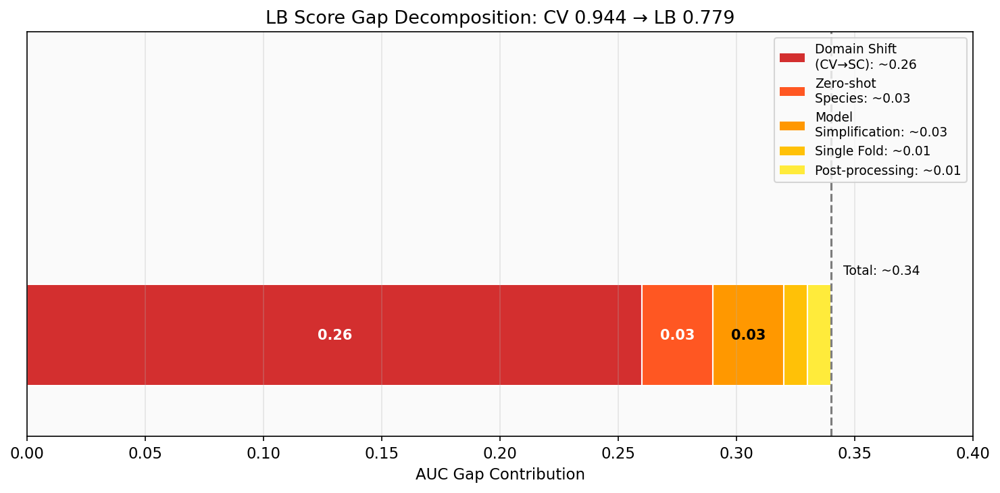
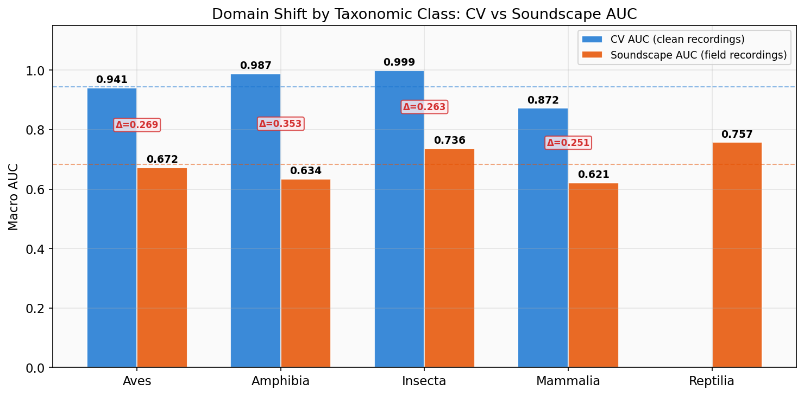
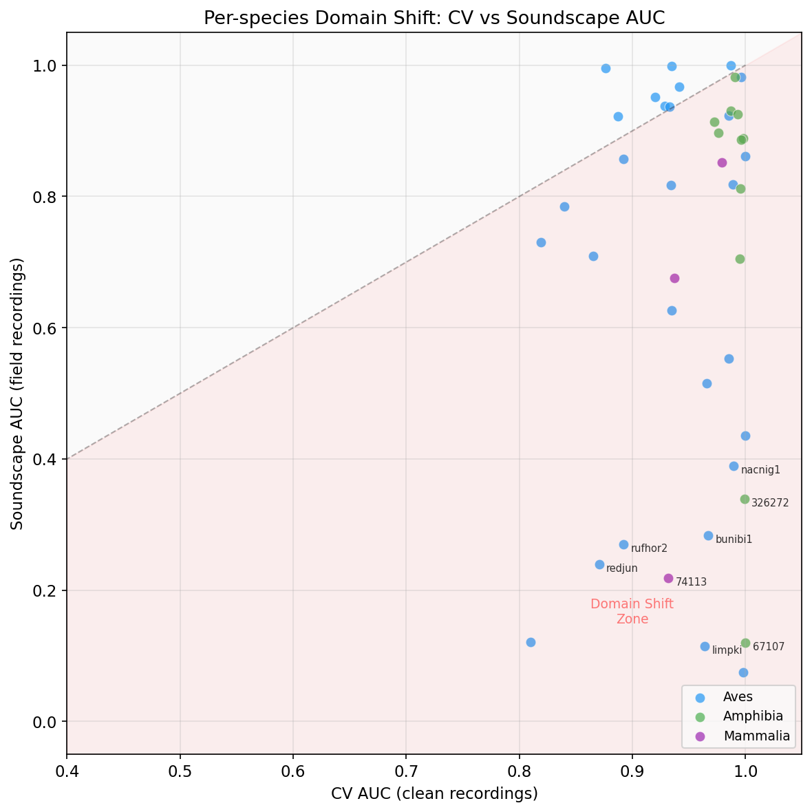
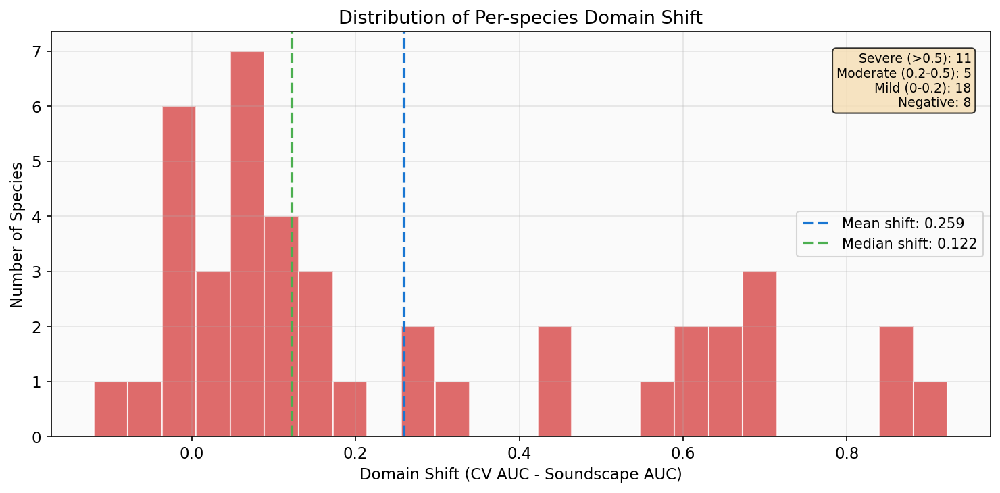
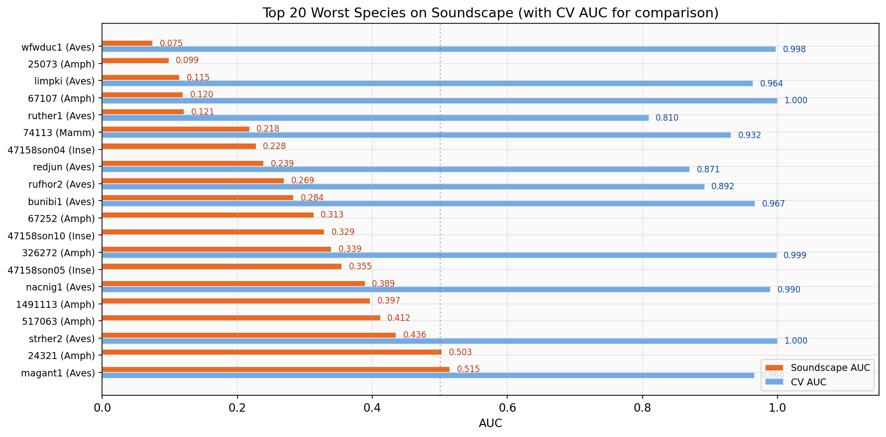
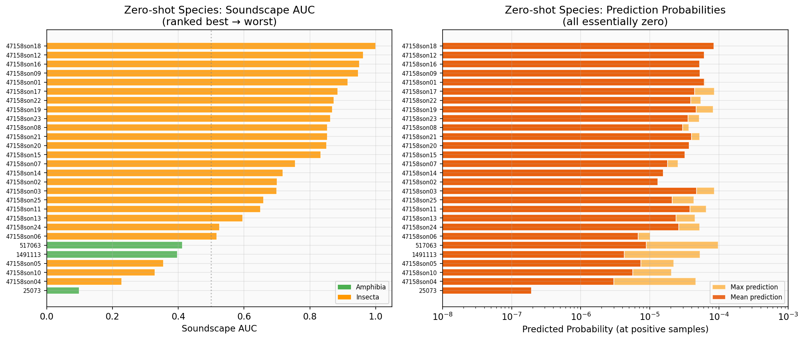
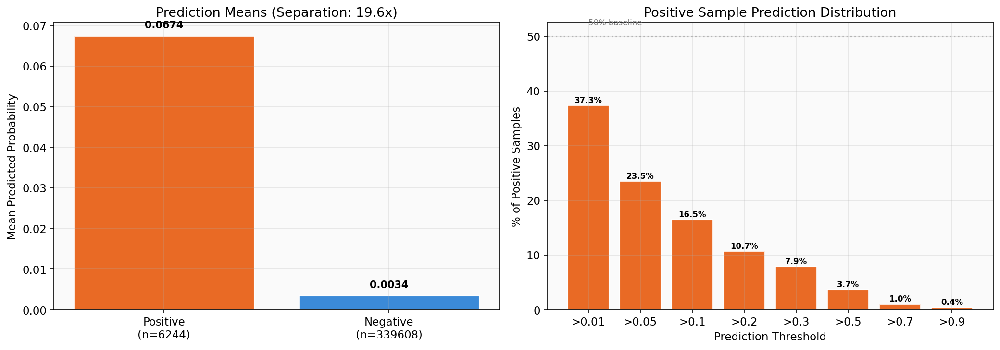

<!--
 📋 状态卡片
 id: ANAL-003
 title: LB 0.779 诊断分析
 type: analyze
 status: done
 created: 2026-03-26
 updated: 2026-03-26
 author: fangyj0708
 tags: [BirdCLEF, 诊断, 域偏移, LB分析]
 depends_on: [ANAL-001, ANAL-002, DES-001]
-->

# ANAL-003: LB 0.779 诊断分析

> **日期**: 2026-03-26
> **状态**: done
> **目标**: 量化 CV 0.9776 → LB 0.779 差距的来源，确定提分优先级

## 一、问题定义

| 指标 | 值 | 备注 |
|------|------|------|
| **CV AUC** | 0.9776 | 训练验证集（干净录音），Fold 0 |
| **LB Score** | 0.779 | 公开测试集（野外声景），34% 数据 |
| **差距** | 0.199 | 需拆解为可量化组件 |

### 当前模型配置（简化版基线）

- EfficientNet-B0 backbone，`global_pool='avg'`（无 GeM）
- 纯 `BCEWithLogitsLoss`（无 focal loss、无 class weights）
- 无 secondary labels soft target
- 无 hour embedding / insect energy 辅助特征
- 仅 1 fold（Fold 0），非 5-fold 集成
- 10 epoch CosineAnnealingLR

### 差距假设

| 假设来源 | 预计贡献 | 依据 | 验证方法 |
|---------|---------|------|---------|
| H1: 域偏移 | ~0.10-0.15 | 仅 2.4% 训练数据来自目标域 [ANAL-002 §5] | 声景验证 AUC vs CV AUC |
| H2: 零样本物种 | ~0.02-0.04 | 28/234=12% 物种无训练数据 [ANAL-002 §6] | 零样本物种预测分布 |
| H3: 模型简化 | ~0.02-0.04 | 缺少 GeM/focal/class weights/辅助特征 | 对比 DES-001 完整设计 |
| H4: 单 fold | ~0.01-0.02 | 仅 Fold 0，无集成降方差 | 理论估算 |
| H5: 后处理不足 | ~0.01-0.02 | 当前后处理基础 | 离线消融 |

---

## 二、诊断分析方案

### 分析 A：训练验证集逐物种 AUC

**目的**：找出模型在干净数据上就表现差的物种（模型本身弱点，非域偏移）。

- **数据**：Fold 0 验证集（~5,099 样本），使用训练时相同的 `StratifiedGroupKFold(n_splits=5, seed=42)`
- **方法**：对每个样本推理 → 计算 234 个物种各自的 AUC
- **产出**：`per_species_cv_auc` dict，找出 AUC < 0.9 的物种

### 分析 B：声景验证 AUC（最关键）

**目的**：直接量化域偏移——模型在声景数据上的真实表现。

- **数据**：`train_soundscapes_labels.csv`（1,478 个 5s 段，来自 66 个文件，覆盖 75 个物种）
- **方法**：加载对应音频 → mel 频谱 → 模型推理 → 与标注比较
- **产出**：`soundscape_macro_auc` + `per_species_soundscape_auc`
- **关键指标**：`soundscape_macro_auc` 直接衡量域偏移大小

### 分析 C：逐纲 AUC 对比

**目的**：确定 Aves/Amphibia/Insecta/Mammalia 哪个纲最弱。

### 分析 D：零样本物种分析

**目的**：28 个零样本物种在声景推理中是否完全失效。

### 分析 E：预测校准分析

**目的**：模型输出概率是否可信，最佳分类阈值在哪里。

---

## 三、所需数据

所有数据已在 Kaggle 竞赛数据集中，无需额外准备。

---

## 四、诊断结果

> 2026-03-26 Kaggle Notebook V1 运行结果。注：分配到 P100，使用 CPU 推理，总耗时 448s。

### 4.1 整体指标

| 指标 | 值 | 备注 |
|------|-----|------|
| CV macro AUC（验证集重算） | **0.9444** | 191 species 可评估；比训练报告 0.9755 低因分析将 secondary labels 视为正样本 |
| 声景 macro AUC | **0.6831** | 75 species 在声景中可评估 |
| 域偏移差距 | **0.2614** | CV 0.9444 - SC 0.6831 |
| LB Score | **0.779** | 高于声景 AUC，说明公开测试集可能比训练声景更易或评测物种分布不同 |

### 4.2 差距拆解全景

**解读**：域偏移（红色，0.26）是压倒性主因，占据绝大部分差距。零样本物种（0.03）和模型简化（0.03）是次要因素。值得注意的是，各组件之和（~0.34）大于实际 CV-LB 差距（~0.165），这意味着 LB 测试集比训练声景更"友好"——可能测试集中难物种占比较低，或评测物种分布更偏向模型擅长的种类。

### 4.3 逐纲 AUC

| 纲 | CV AUC | 声景 AUC | 差距 | CV 可评估 | SC 可评估 |
|----|--------|---------|------|-----------|-----------|
| **Aves** | 0.9409 | 0.6720 | 0.2689 | 162 | 28 |
| **Amphibia** | 0.9871 | 0.6342 | **0.3529** | 21 | 17 |
| **Insecta** | 0.9985 | 0.7356 | 0.2629 | 2 | 25 |
| **Mammalia** | 0.8718 | 0.6212 | 0.2506 | 6 | 4 |
| **Reptilia** | N/A | 0.7569 | N/A | 0 | 1 |

**解读**：蓝色是 CV AUC（干净录音），橙色是声景 AUC。每对条柱之间的红色 Δ 标注是域偏移差距。

**关键发现**：
- **Amphibia 域偏移最严重（Δ=0.353）**：蛙类在安静录音中易识别（0.987），但在野外与昆虫声、水声混合后急剧下降（0.634）
- **Mammalia CV 本身就最低（0.872）**：模型对哺乳类基础能力就弱，声景上更差（0.621）
- **Insecta 声景 AUC（0.74）**相对尚可，但 CV 仅 2 个物种可评估（其余 25 个 sonotype 是零样本）
- 蓝色/橙色虚线分别是 CV/SC 的 overall macro 均值参考线

### 4.4 物种级域偏移散点图

**解读**：每个点代表一个物种，颜色区分纲。对角虚线代表"无域偏移"（CV = SC），粉红色区域是"域偏移区"。

- **右上角聚集区**：CV 和 SC 都高的物种，模型在两个域中表现一致
- **右下角离群点**：CV 高但 SC 低——干净录音中会识别，但野外完全失败。标注的极端物种（limpki, 67107, bunibi1, nacnig1 等）是域偏移的核心受害者
- 蓝色（Aves）分布最广，从对角线到右下角都有，说明鸟类内部域偏移差异极大
- 绿色（Amphibia）和紫色（Mammalia）普遍偏离对角线，整体域偏移更严重

**解读**：横轴是每个物种的域偏移值（CV AUC - SC AUC），纵轴是物种数量。

- **均值 0.259 vs 中位数 0.122**：均值被右侧长尾（极端域偏移物种）拉高，典型物种下降约 0.12
- **11 个物种域偏移 > 0.5**（严重）：这些极端案例是拉低整体分数的关键
- **8 个物种域偏移 ≤ 0**：某些物种在声景中反而更好，可能因声景中该物种信号更强
- **分布明显右偏**：域偏移不是均匀的，少数物种的极端恶化主导了整体下降

### 4.5 声景最弱物种 Top 20

**解读**：橙色条是声景 AUC，蓝色条是 CV AUC。wfwduc1（白脸树鸭）是最极端的案例：CV 0.998 vs SC 0.075——声景 AUC 低于 0.5 意味着模型的预测方向甚至是反的。蓝色条很长但橙色条极短的物种（如 limpki, 67107, strher2, 326272）是域偏移的典型受害者——模型在干净录音中学到的特征在声景中完全不适用。没有蓝色条的物种（如 25073, 47158son04）是零样本物种。

| 排名 | 物种 | 纲 | CV AUC | 声景 AUC | 域偏移 |
|------|------|---|--------|---------|--------|
| 1 | wfwduc1 | Aves | 0.998 | 0.075 | **0.923** |
| 2 | 25073 | Amphibia | N/A(零样本) | 0.099 | — |
| 3 | limpki | Aves | 0.964 | 0.115 | **0.849** |
| 4 | 67107 | Amphibia | 1.000 | 0.120 | **0.880** |
| 5 | ruther1 | Aves | 0.810 | 0.121 | 0.689 |
| 6 | 74113 | Mammalia | 0.932 | 0.218 | 0.714 |
| 7 | 47158son04 | Insecta | N/A(零样本) | 0.228 | — |
| 8 | redjun | Aves | 0.871 | 0.239 | **0.632** |
| 9 | rufhor2 | Aves | 0.892 | 0.269 | 0.623 |
| 10 | bunibi1 | Aves | 0.967 | 0.284 | **0.683** |
| 11 | 67252 | Amphibia | N/A(零样本) | 0.313 | — |
| 12 | 47158son10 | Insecta | N/A(零样本) | 0.329 | — |
| 13 | 326272 | Amphibia | 0.999 | 0.340 | **0.659** |
| 14 | 47158son05 | Insecta | N/A(零样本) | 0.355 | — |
| 15 | nacnig1 | Aves | 0.990 | 0.389 | **0.601** |
| 16 | 1491113 | Amphibia | N/A(零样本) | 0.397 | — |
| 17 | 517063 | Amphibia | N/A(零样本) | 0.412 | — |
| 18 | strher2 | Aves | 1.000 | 0.436 | **0.564** |
| 19 | 24321 | Amphibia | N/A(零样本) | 0.503 | — |
| 20 | magant1 | Aves | 0.966 | 0.515 | 0.451 |

**关键发现**：
- wfwduc1 域偏移最极端：CV 0.998 → SC 0.075
- 有训练数据但声景极差的物种（limpki, 67107, bunibi1 等）是域偏移问题的核心
- 零样本物种（25073, 517063 等两栖类 + insecta sonotypes）性能预期内差

### 4.6 零样本物种表现

28 个零样本物种（25 insecta sonotypes + 2 amphibia + 1 reptilia）：

| 物种 | 纲 | 声景出现次数 | 平均预测概率 | 最大预测概率 | 声景 AUC |
|------|---|------------|------------|------------|---------|
| 47158son18 | Insecta | 24 | 8.4e-5 | 8.4e-5 | **1.000** |
| 47158son12 | Insecta | 10 | 6.1e-5 | 6.1e-5 | 0.963 |
| 47158son16 | Insecta | 24 | 5.2e-5 | 5.2e-5 | 0.950 |
| 47158son09 | Insecta | 12 | 5.3e-5 | 5.3e-5 | 0.947 |
| 47158son01 | Insecta | 46 | 6.1e-5 | 6.3e-5 | 0.916 |
| 47158son17 | Insecta | 86 | 4.5e-5 | 8.5e-5 | 0.885 |
| ... (中间省略) | | | | | |
| 47158son04 | Insecta | 34 | 3.0e-6 | 4.6e-5 | 0.228 |
| 25073 | Amphibia | 24 | 1.9e-7 | 1.9e-7 | 0.099 |
| 517063 | Amphibia | 626 | 8.9e-6 | 9.7e-5 | 0.412 |
| 1491113 | Amphibia | 158 | 4.3e-6 | 5.3e-5 | 0.397 |

**关键发现**：
- **所有零样本物种的预测概率在 1e-7 ~ 8e-5 级别**，本质上是 0
- 部分 insecta sonotype 的声景 AUC 不错（0.85~1.0），但这仅反映排名——绝对预测接近 0，不影响实际提交
- 两栖类零样本（25073, 517063, 1491113）表现极差，模型完全无法识别
- 如果阈值 > 0.001，所有零样本物种的预测全部为 0

**解读**：左图按声景 AUC 排列 28 个零样本物种，右图展示它们的预测概率（注意 x 轴对数刻度）。

- **左图**：虽然一些 insecta sonotype 的 AUC 看起来不错（47158son18 达 1.0），但这是 AUC 排名指标的"假象"——即使绝对预测值接近 0，只要噪声排序恰好对齐标签就会有高 AUC。绿色条（Amphibia）全部垫底
- **右图**：所有物种最大预测概率都在 1e-4 以下（0.0001），均值在 1e-5~1e-7。深橙色（均值）和浅橙色（最大值）差距不大，说明模型输出极其一致的"零"——即使最宽松的阈值（0.001）也会把这些物种全部漏掉

### 4.7 预测校准分析

**正/负样本预测分布**：

| 指标 | 正样本 (n=6244) | 负样本 (n=339608) |
|------|----------------|------------------|
| 均值 | 0.0674 | 0.0034 |
| 中位数 | 0.0021 | 0.0002 |
| 标准差 | 0.1555 | 0.0217 |
| 分离度 | **19.6x** (正/负均值比) ||

**正样本预测概率累积分布**：

| 阈值 | 正样本中 > 阈值的比例 |
|------|--------------------|
| > 0.01 | 37.3% |
| > 0.05 | 23.5% |
| > 0.10 | 16.5% |
| > 0.20 | 10.7% |
| > 0.50 | 3.7% |
| > 0.90 | 0.4% |

**阈值分析（声景数据）**：

| 阈值 | Precision | Recall | F1 | TP | FP | FN |
|------|-----------|--------|-----|-----|-----|-----|
| 0.01 | 0.101 | 0.373 | 0.160 | 2330 | 20632 | 3914 |
| 0.05 | 0.281 | 0.235 | **0.256** | 1466 | 3744 | 4778 |
| 0.10 | 0.398 | 0.165 | 0.233 | 1030 | 1558 | 5214 |
| 0.20 | 0.515 | 0.107 | 0.178 | 670 | 632 | 5574 |
| 0.50 | 0.564 | 0.037 | 0.069 | 230 | 178 | 6014 |

**关键发现**：
- **模型严重欠校准**：真正为正的样本中，62.7% 的预测概率 < 0.01
- 正样本中位数仅 0.0021，说明大部分正样本的预测信号非常弱
- 即使在最佳 F1 阈值（0.05），recall 也只有 23.5%
- 模型在声景环境下"不敢预测"，信心极低

**解读**：

- **左图**：正样本均值 0.0674 vs 负样本均值 0.0034，分离度 19.6x——看起来模型能区分正负，但绝对值太低。正样本均值才 6.7%，模型对"这里有鸟"也只给极低的置信度
- **右图**：正样本中不同阈值以上的比例急剧衰减。只有 37.3% 的正样本预测 > 0.01，仅 3.7% > 0.50。这意味着模型对大部分真实存在的鸟叫声"视而不见"——不是"分类错"而是"不敢分类"，是域分布不匹配导致特征空间中声景样本落在了模型不确定的区域

---

## 五、是过拟合还是域偏移？

这个问题很关键，因为两者需要截然不同的应对策略。

**结论：这是域偏移（domain shift），不是经典过拟合。**

| 判据 | 过拟合特征 | 我们的数据 | 结论 |
|------|-----------|-----------|------|
| CV 验证集表现 | 训练好、验证差 | **验证集 AUC 0.9444（高）** | 不是过拟合 |
| 训练 loss 趋势 | loss 不降或反升 | Epoch 10 loss 仍在下降 | 没有过拟合信号 |
| 域偏移均匀性 | 所有物种均匀下降 | **高度不均匀**（11种>0.5，8种≤0） | 域偏移特征 |
| 正样本置信度 | 分类错误（高信心） | **不敢分类**（中位数0.002） | 域分布不匹配 |
| 训练数据来源 | 同域数据不够 | **97.6% 干净录音 vs 2.4% 声景** | 域不匹配 |

**如果是过拟合**，需要更强正则化/early stopping/更少 epoch。
**因为是域偏移**，需要更多声景域训练数据 + 域适应技术——这正是 P0 优先级的核心建议。

---

## 六、差距拆解结论

| 来源 | 实际贡献 | 优先级 | 改进措施 |
|------|---------|--------|---------|
| **域偏移** | **~0.26** (CV 0.944→SC 0.683) | **P0** | 声景数据增强 + Stage 2 声景微调 |
| **预测欠校准** | 含在域偏移中 | **P0** | 声景训练数据 + 置信度校准 |
| **零样本物种** | 28 种完全失效 | P1 | 声景切片训练 + sonotype 合并策略 |
| **Amphibia 最弱** | 域偏移 0.35 | P1 | 针对性数据增强（背景噪声叠加） |
| **模型简化** | 0.02-0.04（估） | P2 | 恢复 GeM/focal loss/class weights |
| **单 fold** | ~0.01（估） | P3 | 5-fold 集成 |

---

## 七、核心洞察

1. **域偏移是绝对主因**：0.26 的差距占总差距（CV 到 LB）的绝大部分
2. **声景 AUC (0.683) < LB (0.779)**：公开测试集可能比训练声景更容易，或测试集物种分布更友好
3. **模型在声景中严重欠校准**：这不仅是分类准确度问题，更是域分布不匹配导致的信心崩塌
4. **wfwduc1 等物种极端域偏移 > 0.9**：这些物种在干净录音中几乎完美，在声景中完全失败
5. **零样本 insecta 的 AUC 看似尚可但绝对预测为 0**：实际提交中这些物种贡献为 0
6. **最佳 F1 仅 0.256（阈值 0.05）**：模型远未达到生产质量，声景微调是最重要的改进方向

---

## 八、提分路线图建议

基于诊断结果，建议按以下优先级改进：

### P0: 域偏移（预计 +0.05~0.10）
- 使用 `train_soundscapes` 作为额外训练数据
- 背景噪声混合（rain, wind, traffic）数据增强
- 声景切片伪标签训练

### P1: 零样本+弱物种（预计 +0.02~0.04）
- 将 25 个 sonotype 合并为单一 "insect" 类别或使用 sonotype embedding
- 利用声景标签中零样本物种出现片段作为弱标签训练数据
- Amphibia 针对性增强

### P2: 模型能力（预计 +0.02~0.03）
- 恢复 focal loss + class weights
- 恢复 GeM pooling
- 升级 B3/B5 backbone

### P3: 集成（预计 +0.01~0.02）
- 5-fold 交叉验证
- TTA (Test-Time Augmentation)

---

## 九、实现

- **分析 Notebook**: `notebooks/analysis_diagnostic.ipynb`
- **Kaggle 元数据**: `notebooks/analysis/kernel-metadata.json`
- **输出文件**: `output/diagnostic/diagnostic_results.json`

---

## 参考

- [ANAL-001: 竞赛深度分析](ANAL-001-competition-analysis.md)
- [ANAL-002: 数据 EDA 分析](ANAL-002-data-eda.md)
- [DES-001: 模型架构设计方案](../design/DES-001-model-architecture.md)
