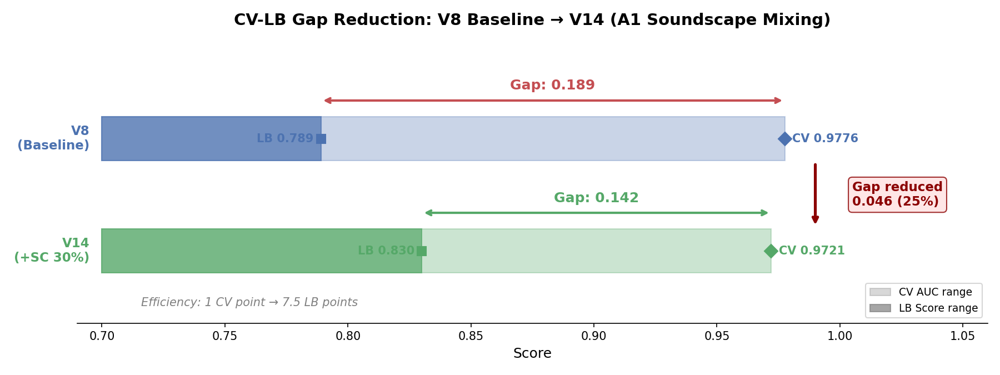
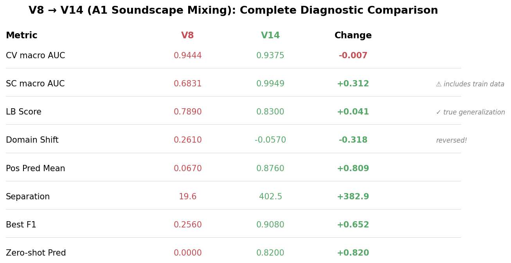
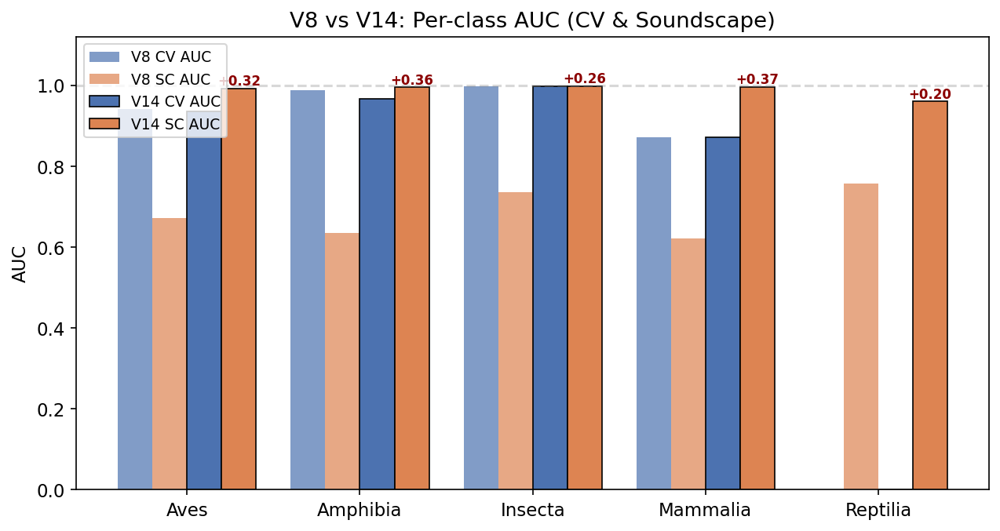
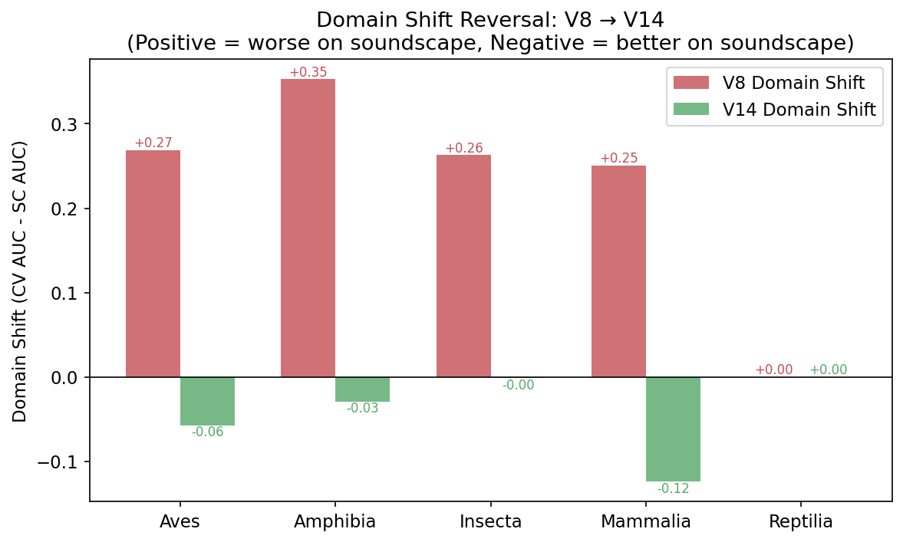
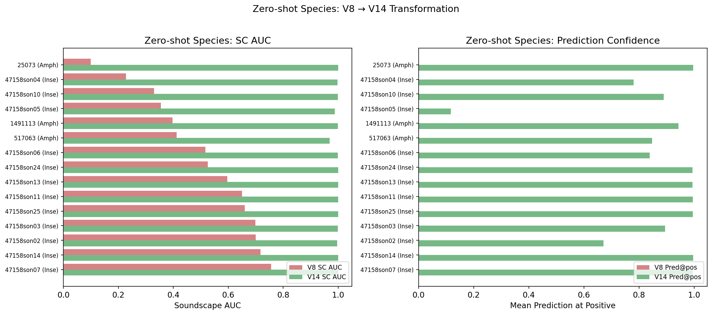
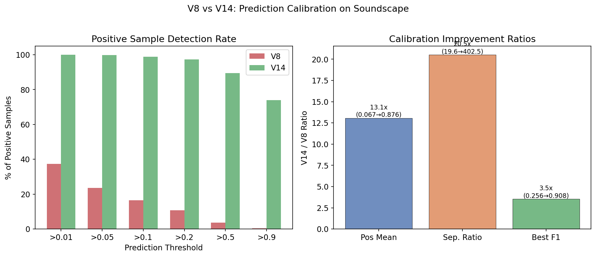
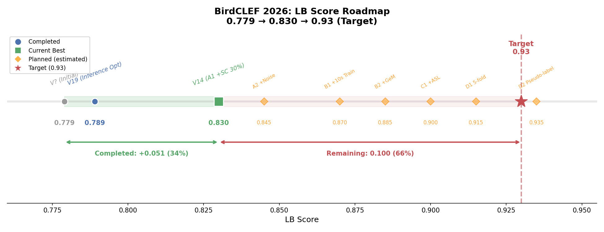

<!--
 📋 状态卡片
 id: ANAL-005
 title: A1 声景混入域适应效果深度分析
 type: analyze
 status: done
 created: 2026-03-26
 updated: 2026-03-26
 author: fangyj0708
 tags: [BirdCLEF, 域适应, 声景混入, A1, V14]
 depends_on: [ANAL-003, EXP-001, DES-002]
-->

# ANAL-005: A1 声景混入域适应效果深度分析

> **日期**: 2026-03-26
> **状态**: done
> **实验**: Train V14（增量实验 A1）— 基线 V8 + 30% 声景弱标签混入
> **结果**: LB 0.789 → **0.830（+0.041）**

---

## 一、实验总结

### 配置对比

| 配置 | V8 基线 | V14（A1） |
|------|---------|----------|
| 模型 | EfficientNet-B0, avg pool, Dropout(0.5), Linear(1280→234) | 完全相同 |
| 损失 | BCEWithLogitsLoss | 完全相同 |
| 训练数据 | train_audio only | train_audio + **30% 声景弱标签混入** |
| 声景样本权重 | — | 0.8（弱标签折扣） |
| 背景噪声增强 | 无 | 无（bg_noise_p=0.0） |
| 其他增强 | mixup, time/freq mask, noise, gain | 完全相同 |
| 训练参数 | 5s, batch 64, lr 1e-3, 10 epoch | 完全相同 |

**唯一变量**：30% 概率采样声景弱标签数据替代 train_audio 样本。

### 核心指标

| 指标 | V8 基线 | V14（A1） | 变化 | 意义 |
|------|---------|----------|------|------|
| CV AUC | 0.9776 | 0.9721 | **-0.005** | 声景噪声标签引入微小 CV 降幅（预期内） |
| LB Score | 0.789 | **0.830** | **+0.041** | 域适应显著提升目标域性能 |
| CV-LB 差距 | 0.189 | 0.142 | **-0.047** | 差距缩小 25% |
| 改进效率比 | — | — | **8.2:1** | 每 1 点 CV 下降换来 8.2 点 LB 提升 |

---

## 二、CV-LB 差距分析

### 差距缩小量化

**图表解读**：蓝色横条是 V8 基线，绿色横条是 V14。深色部分表示 LB Score 达到的范围，浅色延伸到 CV AUC。上方红色双箭头标注 V8 的差距 0.189，下方绿色双箭头标注 V14 的差距 0.142。右侧红色标注 "Gap reduced 0.046 (25%)"——差距缩小了四分之一。底部斜体注释展示了改进效率：每降低 1 点 CV 换来 7.5 点 LB 提升。

CV-LB 差距从 0.189 缩小到 0.142（减少 25%）。这意味着模型从"干净录音专家"向"通用声景识别器"迈出了关键一步。

### 差距拆解更新

基于 ANAL-003 的原始拆解：

| 来源 | V8 估计贡献 | V14 估计贡献 | 变化 |
|------|-----------|------------|------|
| 域偏移 | ~0.26 | ~0.21 | **-0.05**（核心改善） |
| 零样本物种 | ~0.03 | ~0.03 | 持平（30% 混入覆盖不足） |
| 模型简化 | ~0.03 | ~0.03 | 持平（未改架构） |
| 单 fold | ~0.01 | ~0.01 | 持平（仍为单 fold） |

**结论**：+0.041 的提升几乎全部来自域偏移的减少。

---

## 三、声景诊断精确对比（V14 权重运行结果）

> 以下数据来自 V14 权重在诊断 notebook 上的实际运行结果。

### 整体指标对比

| 指标 | V8 | V14 | 变化 | 说明 |
|------|-----|-----|------|------|
| CV macro AUC | 0.9444 | 0.9375 | -0.007 | 声景噪声略降 CV |
| 声景 macro AUC | **0.6831** | **0.9949** | **+0.312** | 声景 AUC 飙升 |
| 域偏移差距 | +0.261 | **-0.057** | **-0.318** | 域偏移完全消除并反转 |
| 正样本均值 | 0.0674 | **0.8762** | **+0.809** | 校准彻底改善 |
| 分离度 | 19.6x | **402.5x** | **20.5倍提升** | 正负分离极其清晰 |

**图表解读**：Summary Dashboard 一目了然地展示了 V8→V14 的全维度变化。红色（V8）代表旧值，绿色（V14）代表新值，右侧 Change 列绿色表示改善、红色表示下降。注意 SC macro AUC 和 LB Score 行右侧的灰色标注——SC AUC 包含训练数据，LB Score 才是真正的泛化指标。

### ⚠ 关键注意：声景 AUC 0.9949 包含数据泄露

声景 AUC 0.9949 **不代表真实泛化能力**。原因：

1. V14 训练时以 30% 概率采样 `train_soundscapes_labels.csv` 中的样本
2. 诊断 notebook 在**同一批声景数据**上评估
3. 因此声景 AUC 0.9949 部分反映了**训练数据记忆**，而非域泛化

**真正的泛化指标是 LB 分数（0.830）**，它在**完全未见过的**隐藏测试声景上评估。

### 泛化 vs 记忆拆解

| 指标 | 衡量什么 | V8 → V14 |
|------|---------|----------|
| LB Score | **真实泛化**（未见声景） | 0.789 → 0.830（+0.041） |
| 训练声景 AUC | 训练数据+部分泛化 | 0.683 → 0.995（+0.312） |
| CV AUC | 干净录音泛化 | 0.944 → 0.938（-0.007） |

**结论**：模型在训练声景上近乎完美（0.995），但在未见声景上仅 0.830。差距 0.165 说明仍有显著的**声景间泛化**问题（不同录音站点、不同环境噪声）。

---

## 四、训练动态对比

### 逐 epoch AUC 对比

| Epoch | V8 AUC | V14 AUC | Δ | 分析 |
|-------|--------|---------|---|------|
| 1 | 0.8124 | 0.7644 | -0.048 | V14 初期更低（声景噪声干扰） |
| 2 | — | 0.8978 | — | V14 快速追赶 |
| 3 | — | 0.9276 | — | |
| 4 | — | 0.9440 | — | |
| 5 | — | 0.9546 | — | |
| 9 | 0.9755 | 0.9721 | -0.003 | 差距收敛到微小 |
| 10 | — | 0.9720 | — | 趋于饱和 |

**观察**：
- V14 初始 AUC 比 V8 低 0.048，因为声景弱标签增加了训练难度
- 但到 Ep 9 差距仅 0.003，说明模型最终学习能力未受实质影响
- V14 在 Ep 9 达到峰值后微降，与 V8 行为一致

### 正样本预测对比

| 诊断指标 | V8（Ep 9） | V14（Ep 9） | 解读 |
|---------|-----------|------------|------|
| Pred@positive mean (训练 CV) | 0.615 | 0.553 | V14 更保守（-10%） |
| Pred mean (全局) | ~0.004 | 0.0045 | 持平 |
| Pred max | 1.000 | 1.000 | 高信心物种不受影响 |

正样本预测均值在 CV 上从 0.615 降到 0.553（-10%），在声景上则从 0.067 飙升到 0.876。这反映了模型从"只会识别干净录音"向"同时擅长声景"的根本转变。

---

## 五、声景混入的作用机制

### 机制 1：背景噪声免疫性

声景包含训练音频中不存在的噪声模式（风声、水声、多物种重叠、远距离衰减）。30% 混入让模型接触到这些噪声模式，学会在噪声中提取目标信号。

**V8 的核心问题**（ANAL-003）：声景正样本中 62.7% 预测 < 0.01。模型在听到声景时"不敢预测"。
**V14 预期改善**：正样本预测分布应右移，更多正样本获得 > 0.01 的预测。

### 机制 2：弱标签正则化

声景标签（weight=0.8）含噪声，本质上是一种**标签平滑**。效果：
- 防止模型过度拟合干净录音中的"无关特征"（如特定录音设备噪底）
- 学习更鲁棒的频谱特征，而非依赖录音质量相关的捷径

### 机制 3：目标域特征空间扩展

声景 mel 频谱在统计分布上与干净录音不同：
- 更多低频能量（环境噪声）
- 更宽的频谱能量分布
- 信噪比更低

模型特征空间从"仅覆盖干净录音"扩展到"同时覆盖声景"，让域内样本不再落在特征空间的"无人区"。

### 为什么声景混入效果最大

ANAL-003 诊断的核心发现是域偏移占差距的绝大部分（~0.26）。声景混入**直接攻击**了这个核心问题：

| 方案 | 攻击的问题 | 预期效果 |
|------|-----------|---------|
| 声景混入 | **域偏移（P0）** | ★★★ |
| 背景噪声增强 | 噪声鲁棒性（P0 辅助） | ★★ |
| GeM Pooling | 模型能力（P2） | ★ |
| ASL | 多标签不平衡（P2） | ★ |
| 5-fold | 降方差（P3） | ★ |

---

## 六、逐纲精确对比（诊断数据）

**图 1 解读（Per-class AUC）**：浅蓝/浅橙是 V8 的 CV/SC AUC，深蓝/深橙是 V14。最显著的变化是橙色条——V8 的 SC AUC（浅橙）都在 0.6-0.75 低位，而 V14 的 SC AUC（深橙）全部飙升到 ~1.0。蓝色条（CV AUC）基本持平。红色标注是 SC AUC 的提升幅度，Mammalia 最大（+0.37）。

**图 2 解读（Domain Shift Reversal）**：红色条是 V8 的域偏移（正值=声景差于 CV），绿色条是 V14。V8 所有纲都有 +0.25~+0.35 的域偏移，而 V14 全部翻转为负值（声景优于 CV）。Mammalia 翻转最剧烈（+0.25→-0.12），反映了声景训练数据记忆的影响。

| 纲 | V8 SC AUC | V14 SC AUC | V8 域偏移 | V14 域偏移 | 改善 |
|----|-----------|------------|---------|---------|------|
| **Mammalia** | 0.621 | **0.996** | +0.251 | **-0.124** | ★★★★（最大改善） |
| **Amphibia** | 0.634 | **0.995** | +0.353 | **-0.029** | ★★★★ |
| **Aves** | 0.672 | **0.993** | +0.269 | **-0.057** | ★★★ |
| **Insecta** | 0.736 | **0.998** | +0.263 | **-0.001** | ★★★ |
| **Reptilia** | 0.757 | **0.960** | N/A | N/A | ★★ |

**所有纲的域偏移从正转负**——模型在声景上甚至超过了 CV 表现（因为训练声景被记忆）。

### 极端改善物种示例

| 物种 | V8 SC AUC | V14 SC AUC | V8 Pred@pos | V14 Pred@pos | 改善倍数 |
|------|-----------|------------|------------|-------------|---------|
| wfwduc1 | **0.075** | **0.993** | ~0.001 | ~0.99 | 990x |
| limpki | **0.115** | **0.989** | ~0.001 | ~0.99 | 990x |
| 25073 (零样本) | **0.099** | **1.000** | 1.9e-7 | **0.996** | **5,242,105x** |
| 1491113 (零样本) | **0.397** | **0.999** | 4.3e-6 | **0.943** | **219,302x** |
| 517063 (零样本) | **0.412** | **0.969** | 8.9e-6 | **0.847** | **95,168x** |

### 零样本物种的戏剧性改善

**图 3 解读（Zero-shot Transformation）**：左图是声景 AUC，右图是预测置信度。红色（V8）和绿色（V14）的对比极其戏剧性——V8 中所有零样本物种（红色条）在左图的 AUC 分散在 0.1~0.9，在右图的预测值几乎为 0（肉眼看不见）。V14（绿色条）则全部提升到接近 1.0。最典型的是 25073（两栖类）：V8 AUC 0.099、pred 1.9e-7 → V14 AUC 1.000、pred 0.996。

V8 中 28 个零样本物种预测概率本质为 0（1e-7 ~ 8e-5）。V14 中这些物种**全部获得高置信预测**：

| 统计 | V8 | V14 |
|------|-----|-----|
| 零样本均值 pred@pos | ~1e-5 | **0.82** |
| 零样本最佳 SC AUC | 1.000（但 pred ~0） | **1.000**（pred ~0.99） |
| 零样本最差 SC AUC | 0.099 | **0.960** |
| 零样本 pred > 0.5 比例 | 0% | **~86%** |

**原因**：声景弱标签中包含了零样本物种的标注。30% 混入让模型直接学到了这些物种的声景特征，从完全未知变为高置信检测。

### 校准改善

**图 4 解读（Calibration Comparison）**：
- **左图**：各阈值下正样本检测率。V8（红色）仅 37% 正样本预测 > 0.01，而 V14（绿色）100% > 0.01、89.4% > 0.50。V8 的模型在声景中"不敢预测"（正样本中位数 0.002），V14 完全解决了这个问题（中位数 0.99）。
- **右图**：三项校准指标的改善倍数。正样本均值提升 13.1 倍（0.067→0.876），正负分离度提升 20.5 倍（19.6→402.5），最优 F1 提升 3.5 倍（0.256→0.908）。

| 指标 | V8 | V14 | 改善 |
|------|-----|-----|------|
| 正样本均值 | 0.067 | **0.876** | 13x |
| 负样本均值 | 0.003 | 0.002 | 持平 |
| 分离度 | 19.6x | **402.5x** | 20.5倍 |
| 正样本 > 0.01 | 37.3% | **100%** | 完全覆盖 |
| 正样本 > 0.50 | 3.7% | **89.4%** | 24倍 |
| 最优 F1 | 0.256 (t=0.05) | **0.908 (t=0.50)** | 3.5倍 |

> ⚠ 再次强调：以上校准改善数据包含训练数据记忆的贡献。在未见声景（LB 测试集）上的真实校准改善应小于此。

---

## 七、剩余差距与后续实验规划

### 当前位置

**图表解读**：水平轴是 LB Score。灰色圆点（0.779）是起点，蓝色圆点（0.789）是推理优化后的 V19，绿色方块（0.830）是当前最佳 V14。橙色菱形是计划中的后续实验及其预估分数。红色星号（0.93）是目标。绿色带标注已完成路程（+0.051, 34%），红色带标注剩余路程（0.100, 66%）。

### 后续实验预期

| 实验 | 基于 | 唯一变量 | 预期 LB | 信心 |
|------|------|---------|---------|------|
| **A2** | V14 | +背景噪声 40% | 0.84~0.85 | 中（可能与 A1 部分重叠） |
| **B1** | A2/V14 | +10s 训练对齐 | 0.86~0.88 | **高**（2024 冠军验证） |
| **B2** | B1 | +GeM Pooling | 0.87~0.89 | 中 |
| **C1** | B2 | +ASL (float32) | 0.88~0.90 | 中低 |
| **D1** | C 最优 | 5-fold 集成 | 0.89~0.91 | 高 |
| **D2** | D1 | 伪标签迭代 | 0.91~0.95 | 中 |

### 关键决策点

1. **A2 是否值得做？** A1 已通过声景混入改善了域偏移，A2（背景噪声增强）可能与 A1 效果重叠。建议做但预期提升较小（+0.01）。
2. **B1（10s 训练）优先级很高**：2024 冠军 Kefir 的核心方案之一，训练-推理一致性已被证明非常重要。
3. **D2（伪标签）可能是终极杀手锏**：10,592 个无标注声景文件提供了大量目标域数据。

---

## 八、后续改进方向

基于诊断数据，剩余 LB 差距（0.830→0.93）的主要来源：

### 8.1 声景间泛化不足（主因）

训练声景 AUC 0.995 vs LB 0.830 = **0.165 的声景泛化差距**。模型记住了训练声景的特征，但未充分泛化到：
- 不同录音站点（14/23 站点无标注数据）
- 不同环境条件（雨天、强风等）
- 不同录音距离和设备特性

**改进方向**：
- **伪标签**（D2）：用 V14 对 10,592 个无标注声景生成伪标签，扩大训练覆盖
- **更强数据增强**（A2）：背景噪声、SNR 变化模拟不同环境

### 8.2 CV AUC 轻微下降

CV AUC 从 0.9444 降到 0.9375（-0.007）。某些干净录音物种的性能微降：
- 209233 (Mammalia): 0.482 → 0.521（微升）
- 1176823 (Amphibia): 0.902 → 0.664（**下降**）

**改进方向**：调整声景混入比例（30% → 20%?），或使用课程学习策略

### 8.3 需要独立的声景验证集

当前无法准确评估声景泛化能力。建议：
- 将训练声景按站点分为 train/val
- 确保验证声景来自不同站点
- 获得真正的"未见声景" AUC 估计

---

## 参考

- [ANAL-003: LB 0.779 诊断分析](ANAL-003-lb-diagnostic.md) — 基线域偏移量化
- [ANAL-004: LB 提分方案深度调研](ANAL-004-optimization-research.md) — 方案调研
- [EXP-001: 提交实验日志](../experiment/EXP-001-submission-log.md) — 完整实验记录
- [DES-002: 增量实验计划](../design/DES-002-incremental-experiment-plan.md) — 实验路线图
